# MySQL – Cliente / Servidor  
Instalación y Configuración de MySQL en entorno cliente-servidor (Ubuntu 24.04)

La siguiente documentación explica paso a paso la instalación, configuración y prueba de conexión de MySQL en un servidor y un cliente Ubuntu 24.04 utilizados en Isard, así como la posterior creación de una base de datos, tablas e inserción de registros.

---

## Entorno utilizado

Utilizaremos dos máquinas Ubuntu 24.04 con las siguientes interfaces de red:

SERVER: 192.168.1.17  
CLIENTE: 192.168.1.16  

---

## Configuración inicial del servidor

En este caso empezaremos con una máquina en Isard que actuará como servidor, la cual renombraremos con el siguiente comando:

```bash
sudo hostnamectl set-hostname dosorio-server
````

---

## Instalación de MySQL

Nuestro objetivo es instalar MySQL en el servidor para que actúe como servidor de bases de datos. Para ello, ejecutamos el siguiente comando:

```bash
isard@dosorio-server:~$ sudo apt install mysql-server
```

Una vez finalizada la instalación, comprobamos la versión descargada:

```bash
isard@dosorio-server:~$ mysql -V
mysql  Ver 8.0.43-0ubuntu0.24.04.2 for Linux on x86_64 ((Ubuntu))
```

A continuación, verificamos que el servicio esté activo y funcionando correctamente:

```bash
isard@dosorio-server:~$ sudo systemctl status mysql
```

Como se puede observar en la salida, el servicio se encuentra en estado **active (running)**, por lo que MySQL está funcionando correctamente.

---

## Acceso local a MySQL desde el servidor

Para comprobar que podemos acceder a MySQL desde la propia máquina servidor, ejecutamos el siguiente comando:

```bash
isard@dosorio-server:~$ sudo mysql
```

Una vez dentro, se nos muestra el monitor de MySQL, lo que confirma que el acceso local funciona correctamente.

También podemos acceder como usuario `root`, lo cual es recomendable para tareas de administración:

```bash
mysql -u root -p
```

En caso de que no tengamos contraseña asignada al usuario `root`, podemos establecerla desde MySQL con la siguiente orden:

```sql
ALTER USER 'root'@'localhost'
IDENTIFIED WITH mysql_native_password BY 'Dhayanseña';
```

Aplicamos los cambios con:

```sql
FLUSH PRIVILEGES;
```

---

## Carga de la base de datos

Para esta práctica utilizaremos una base de datos llamada `nba`.
El archivo `nba.sql` se copia al servidor mediante SSH desde la máquina cliente:

```bash
alumne@dosoriocliente:~/Escriptori/sql$ scp nba.sql isard@192.168.1.17:~/sql
```

Una vez copiado el archivo, accedemos a MySQL y creamos la base de datos:

```sql
CREATE DATABASE nba;
USE nba;
SOURCE ~/sql/nba.sql;
```

Comprobamos que las tablas se han creado correctamente:

```sql
SHOW TABLES;
```

Y realizamos una consulta sencilla para verificar los datos:

```sql
SELECT * FROM equipos LIMIT 5;
```

---

## Permitir conexiones remotas al servidor MySQL

Para permitir que el cliente se conecte al servidor MySQL a través de la red, es necesario modificar el archivo de configuración.

Editamos el archivo `mysqld.cnf`:

```bash
isard@dosorio-server:~$ sudo nano /etc/mysql/mysql.conf.d/mysqld.cnf
```

Buscamos la línea:

```conf
bind-address = 127.0.0.1
```

Y la modificamos por:

```conf
bind-address = 0.0.0.0
```

De esta manera, MySQL escuchará en todas las interfaces de red.

Guardamos los cambios y reiniciamos el servicio:

```bash
sudo systemctl restart mysql
```

Comprobamos nuevamente su estado:

```bash
sudo systemctl status mysql
```

---

## Creación de un usuario con permisos de acceso remoto

Accedemos a MySQL como usuario `root`:

```bash
mysql -u root -p
```

Creamos un usuario que pueda conectarse desde la red local:

```sql
CREATE USER 'dhayancliente'@'192.168.1.%'
IDENTIFIED BY 'Dhayanseña';
```

Le otorgamos permisos sobre la base de datos `nba`:

```sql
GRANT ALL PRIVILEGES ON nba.* TO 'dhayancliente'@'192.168.1.%';
FLUSH PRIVILEGES;
```

Comprobamos los permisos asignados:

```sql
SHOW GRANTS FOR 'dhayancliente'@'192.168.1.%';
```

---

## Segunda parte: Cliente (terminal)

En la máquina cliente instalamos el cliente MySQL:

```bash
alumne@dosoriocliente:~$ sudo apt update
alumne@dosoriocliente:~$ sudo apt install mysql-client
```

Una vez instalado, probamos la conexión remota al servidor:

```bash
alumne@dosoriocliente:~$ mysql -h 192.168.1.17 -u dhayancliente -p
```

Accedemos a la base de datos y comprobamos su contenido:

```sql
USE nba;
SHOW TABLES;
SELECT * FROM jugadores LIMIT 3;
```

Como se puede comprobar, la conexión remota funciona correctamente.

---

## Tercera parte: Cliente remoto (MySQL Workbench)

El siguiente paso es instalar MySQL Workbench en la máquina cliente. Para ello utilizaremos `snapd`.

Instalamos `snapd`:

```bash
alumne@dosoriocliente:~$ sudo apt install snapd
```

Una vez instalado, procedemos a instalar MySQL Workbench:

```bash
alumne@dosoriocliente:~$ sudo snap install mysql-workbench-community
```

Comprobamos que MySQL Workbench se ha instalado correctamente buscándolo en el sistema:


<figure>
  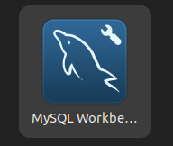
</figure>

Abrimos la aplicación y verificamos que se inicia correctamente:


<figure>
  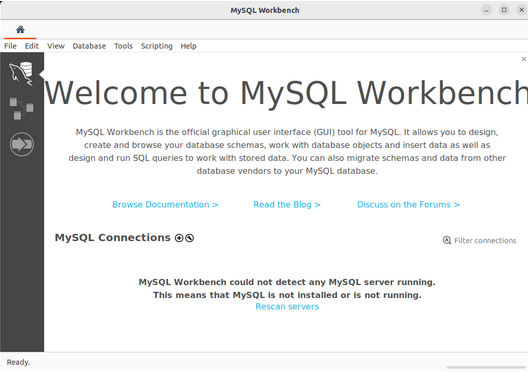
</figure>


En la pantalla inicial de MySQL Workbench, hacemos clic en el botón **“+”** o **“New Connection”** para crear una nueva conexión:


<figure>
  
</figure>


Rellenamos los datos de conexión al servidor MySQL y pulsamos **“Test Connection”**:


<figure>
  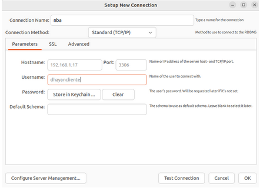
</figure>


Introducimos la contraseña del usuario creado anteriormente:


<figure>
  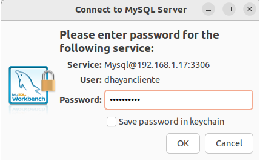
</figure>


Si la conexión es correcta, se mostrará una ventana de confirmación:


<figure>
  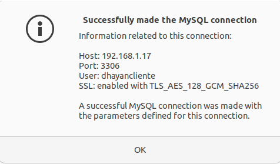
</figure>


Una vez creada la conexión, accedemos a ella desde la pantalla principal:


<figure>
  
</figure>


En el panel izquierdo, seleccionamos **Schemas**, localizamos la base de datos `nba`, hacemos clic derecho sobre ella y seleccionamos **Set as Default Schema**:

<figure>
  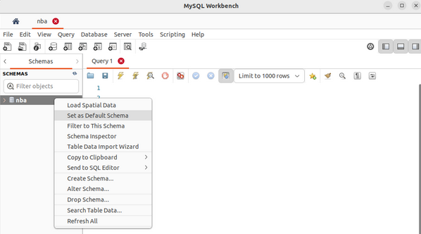
</figure>


Ejecutamos una consulta pulsando el botón con forma de rayo y comprobamos que las tablas se han cargado correctamente:


<figure>
  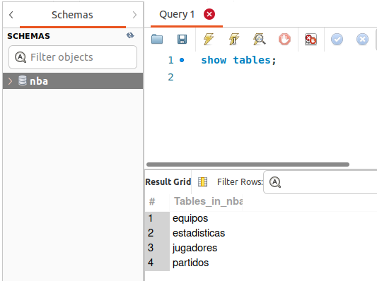
</figure>


Realizamos una consulta adicional para comprobar los valores almacenados:


<figure>
  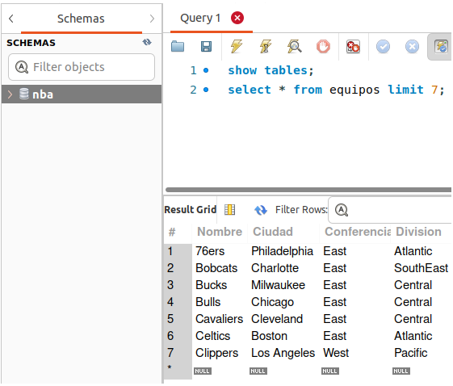
</figure>


Con esto, queda comprobado el correcto funcionamiento de MySQL Workbench.

---

## Cuarta parte: Cliente (DBeaver)

A continuación, comprobamos la conexión utilizando DBeaver desde la máquina cliente.

Abrimos DBeaver y seleccionamos **New Database Connection** desde el menú **Database**:


<figure>
  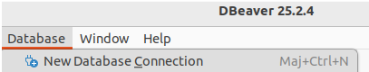
</figure>


Seleccionamos MySQL como tipo de base de datos:


<figure>
  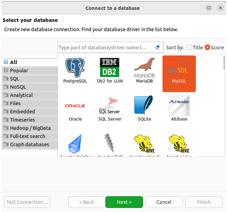
</figure>


Rellenamos los datos necesarios para la conexión y pulsamos **Finish**:


<figure>
  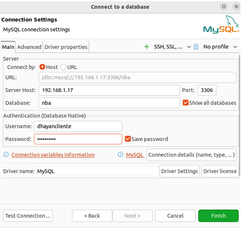
</figure>


En el **Database Navigator**, comprobamos que aparece la base de datos `nba`:


<figure>
  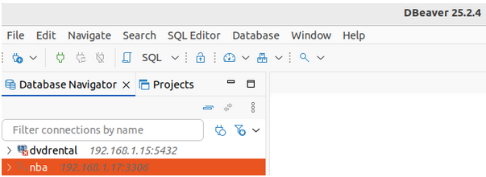
</figure>


Al desplegar la base de datos, DBeaver solicita la descarga de los drivers de MySQL, lo cual aceptamos:


<figure>
  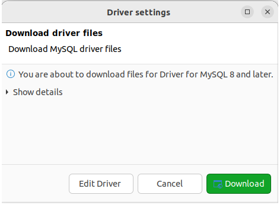
</figure>


Una vez descargados, desplegamos el esquema y accedemos a las tablas para visualizar los datos:


<figure>
  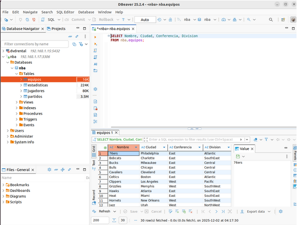
</figure>


Con esta comprobación, damos por finalizada con éxito la práctica.

---

## Quinta parte: Preguntas

### ¿Consideras MySQL un SGBD centralizado o cliente-servidor?

En esta práctica MySQL se ha utilizado claramente como un sistema cliente-servidor.
El servidor MySQL está instalado de forma centralizada y los clientes se conectan por red mediante usuario y contraseña.


### Comparativa con PostgreSQL

Ambas prácticas son muy similares. Las principales diferencias se encuentran en los archivos de configuración, comandos específicos, usuario y puerto por defecto (`postgres` y 5432 en PostgreSQL, `root` y 3306 en MySQL).

---

## Webs de referencia

[https://www.digitalocean.com/community/tutorials/how-to-install-mysql-on-ubuntu-22-04](https://www.digitalocean.com/community/tutorials/how-to-install-mysql-on-ubuntu-22-04)

[https://www.hostinger.com/tutorials/how-to-install-mysql-ubuntu](https://www.hostinger.com/tutorials/how-to-install-mysql-ubuntu)

[https://dev.mysql.com/doc/employee/en/employees-installation.html](https://dev.mysql.com/doc/employee/en/employees-installation.html)

[https://10web.io/blog/mysql-error-1698/](https://10web.io/blog/mysql-error-1698/)

```
